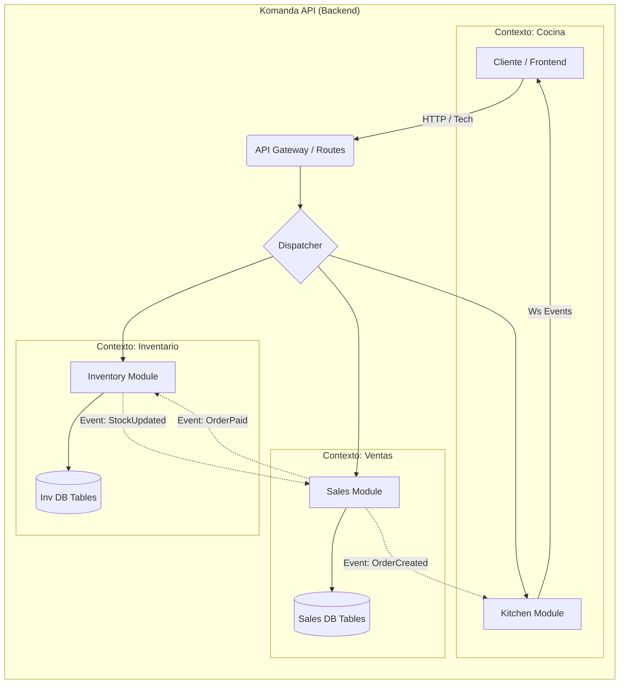

# 🏗️ Arquitectura y filosofia

> "Si rompes esta arquitectura, rompes el proyecto. No seas ese tipo."

## 🌟 Visión General

KOMANDA no es un monolito espagueti. Es un **Monolito Modular** estructurado bajo principios de **DDD-Lite (Domain-Driven Design)**.

¿Por qué? Porque queremos la simplicidad de despliegue de un monolito, pero la escalabilidad mental de los microservicios.

### 🚫 Anti-Patrones (Lo que NO hacemos)

- **Importaciones Cruzadas Directas:** `import { InventoryService } from '../../inventory'` dentro del módulo de `Sales`. **¡PROHIBIDO!**
- **Lógica en Controladores:** Los controladores solo validan HTTP y llaman a servicios. No calculan impuestos ni deciden si hay stock.
- **Fat Models:** Los modelos de base de datos (TypeORM/Sequelize/etc) solo guardan datos. La lógica de negocio va en Servicios o Clases de Dominio.

---

## 🧩 Diagrama de Módulos

Cada carpeta en `modules/` es un feudo independiente.



---

## 📡 Comunicación entre Módulos

Si `Ventas` necesita saber algo de `Inventario`, **NO** importa su servicio directamente.

### 1. Comunicación Síncrona (Solo lectura)

Usa **Shared Services** o interfaces públicas definidas en `shared/interfaces`.

- _Ejemplo:_ `SalesService` necesita saber el precio actual de un producto. Llama a `PriceQueryService` (un servicio de lectura optimizado).

### 2. Comunicación Asíncrona (Eventos - PREFERIDA)

Usa nuestro **Event Bus** interno.

- _Caso:_ Se vende una hamburguesa.
- `SalesModule` emite: `ORDER_CONFIRMED_EVENT`
- `InventoryModule` escucha y ejecuta: `InventoryService.decrementStock()`
- `KitchenModule` escucha y ejecuta: `KitchenService.addToQueue()`
- `FiscalModule` escucha y ejecuta: `InvoiceService.generate()`

**Ventaja:** Si se cae el módulo de Facturación, la venta sigue ocurriendo y la cocina sigue cocinando.

---

## 📂 Organización de Carpetas (DDD-Lite)

Dentro de cada módulo (`/modules/x`), la estructura es sagrada:

```text
modules/inventory/
├── domain/           # Entidades puras (sin ORM) y Lógica de Negocio
│   ├── product.entity.ts
│   └── stock-movement.ts
├── infrastructure/   # Repositorios, Modelos de DB, Adaptadores externos
│   ├── persistence/
│   │   └── product.repository.ts
├── application/      # Casos de Uso (Services)
│   ├── create-product.use-case.ts
│   └── adjust-stock.service.ts
└── presentation/     # Controladores HTTP, DTOs
    ├── inventory.controller.ts
    └── dtos/
```

> **Nota:** En fases iniciales, puedes simplificar fusionando `domain` y `application` en `services`, pero mantén la separación mental.

---

## 🛡️ Capas de Defensa

1.  **DTOs (Data Transfer Objects):** Validan lo que entra (Zod/ClassValidator). Si el JSON está mal, explota aquí, no en la DB.
2.  **Middlewares:** Autenticación y manejo de errores global. Nunca hagas `try-catch` para enviar un 500 manual en cada controlador.
3.  **Domain Guard:** Validaciones de negocio (ej. "No puedes vender stock negativo"). Esto va en el Servicio/Dominio, NUNCA en el Front.
